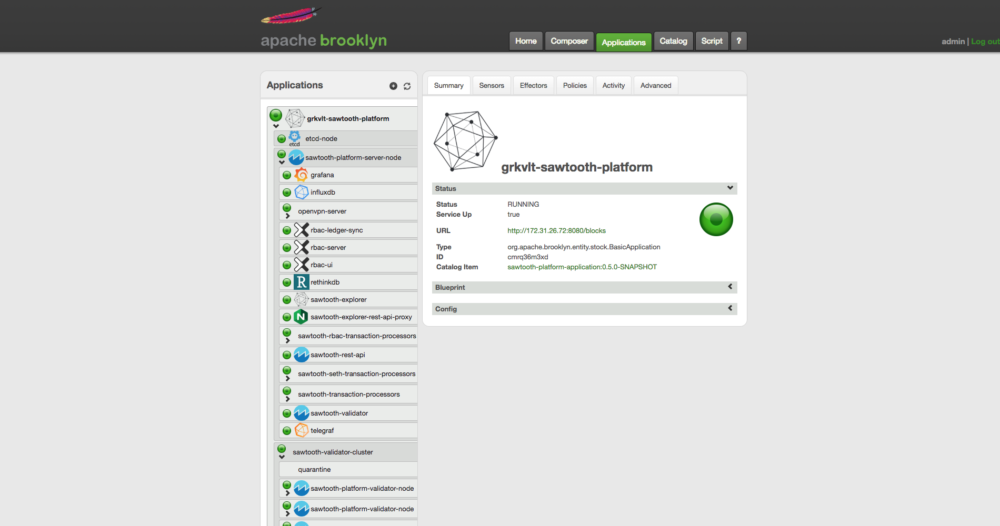

Hyperledger Brooklyn Sawtooth
=============================

This repository contains [Apache Brooklyn](https://brooklyn.apache.org/) blueprints for a [Hyperledger Sawtooth](https://www.hyperledger.org/projects/sawtooth) blockchain platform using [Docker](https://www.docker.com/).

The [Sawtooth platform architecture](./docs/platform.md) consists of a number of separate [components](./docs/components.md) that can be used as the basis for building blockchain applications. The [getting started guide](./docs/getting-started.md) and [further installation guide](./docs/installation.md) show how to start a copy of the platform. This is an early access release of the Brooklyn sawtooth platform, and is intended for development use and testing, rather than for production deployments. However, we are adding more features and configuration options to the platform, that will be useful for building production ready applications.

## Motivation

Our motivation is to simplify the deployment of Hyperledger Sawtooth using Apache Brooklyn to automate this in a wide range of configurations and on a wide range of environments. We intend to offer this to the Hyperledger community as an incubator project along the same lines as [Hyperledger Caliper](https://www.hyperledger.org/projects/caliper) ultimately providing similar blueprints for [Hyperledger Fabric](https://www.hyperledger.org/projects/fabric) and potentially other Hyperledger frameworks.

## Getting Started

This guide will cover deploying Hyperledger Sawtooth to AWS using an Apache Brooklyn server running in a Docker container on your local machine. This blueprint can also deploy Sawtooth to other clouds, and Apache Brooklyn can be run and configured differently. See the [complete instructions](./docs/getting-started.md) for more information.

The only software pre-requisite is a recent version of Docker installed, and you must have credentials and SSH keys available to access the AWS EC2 cloud. You must also have an AWS security group configured which allows access to ports _22_, _3000_, _3030_, _4200_, _4201_, _8000_, _8080_, _8090_ and _9090_ and allows machines in the same group to communicate on all TCP and UDP ports.

Navigate to the root directory of this repository and run the following command to start a Brooklyn server using a Docker image with the Sawtooth platform entities loaded into the catalog:

    $ docker run -d \
            -p 8081:8081 \
            -v ~/keys:/keys \
            -v $(pwd)/examples:/blueprints \
            --name brooklyn \
            blockchaintp/brooklyn-sawtooth:0.5.0-SNAPSHOT
    ae82e15583ac4f32724a2daf0f122d3b6c7075ec3fcc35e35f46f6e300c522a9
    $ docker logs -f brooklyn
    [*] start brooklyn server
    [.] waiting for brooklyn api..................ok
    ...

Note the `/keys` and `/blueprints` volumes being mounted from directories on the host. The files, particularly the SSH keys, must be readable by the `brooklyn` user in the container. See the [`launch.sh`](scripts/launch.sh) script for a more detailed example.

Once the Brooklyn server has started up, the console UI will be accessible at [`http://localhost:8081/`](http://localhost:8081/) and you can also use the `br` command-line tool either on the Docker container or remotely after logging in.

Now you should edit the [example application blueprint](./examples/example.yaml) so that it works with your own AWS account. If you need extra help with this step, see the the [complete instructions](./docs/getting-started.md) for more details.

Set the values of `identity` and `credential` with your access key ID and secret key and update the `keyPair` name with a key pair that is available on your AWS account and set the `loginUser.privateKeyFile` and `privateKeyFile` values to point to the `.pem` for that key par, which should be saved in your `~/keys` directory. Replace the value of the security group ID (`sg-xxxxxx`) with the ID of the security group described above.

When you are finished making these edits, you can deploy the Sawtooth platform using the following Docker command:

    $ docker exec brooklyn br deploy /blueprints/example.yaml
    Id:       | p7n0xemln2
    Name:     | example-sawtooth-platform
    status:   | In progress

Once the Sawtooth network has been deployed, check its status using the Brooklyn console UI, which will provide links to the main Grafana dashboard for metrics or the Sawtooth Explorer to look up raw blockchain data. For more information, see the [Platform Components](./docs/components.md) documentation.

To retrieve some details about the running platform, use the following command:

    $ docker exec brooklyn status.sh example-sawtooth-platform
    {
      "host.address": "172.31.30.8",
      "seth.account": "9a998829441e9f114cc4168c371b24220e844074",
      "administrator.id": "0326a02883aa1394a446455ef3d905adaec01f7b33837c4618180a09a13318c417"
    }

## Contributing

Since Hyperledger Sawtooth is an ever-changing and ever-expanding project, contributions to this repository are welcomed and encouraged in the form of:

* Testing deployments on different clouds and creating issues with feedback
* Adding additional Sawtooth components to the blueprint as part of the platform

---
Copyright 2018 Blockchain Technology Partners Limited; Licensed under the [Apache License, Version 2.0](./LICENSE).
