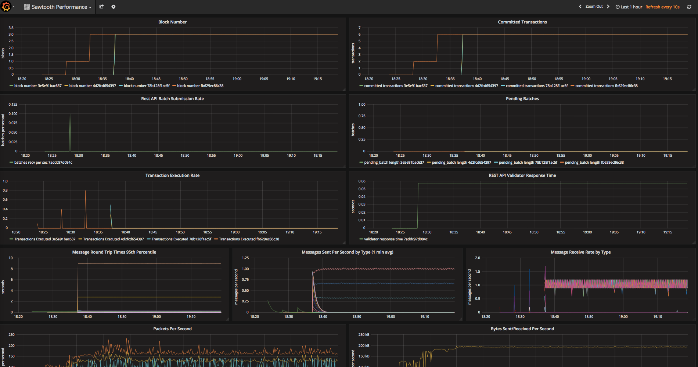

Platform Components
===================

This document will provide an overview of all the components that comprise the Sawtooth platform.

## What Makes Up the Platform?

### Apache Brooklyn

[Apache Brooklyn](https://brooklyn.apache.org/) is a cloud orchestration and management service, used to start and manage the whole Sawtooth platform.

### Sawtooth Core

This is the heart of the platform which consists of the following components:

* [REST API server](https://sawtooth.hyperledger.org/docs/core/releases/latest/architecture/rest_api.html)
* [Validator nodes](https://sawtooth.hyperledger.org/docs/core/releases/latest/architecture/validator_network.html)
* [Settings transaction processor](https://sawtooth.hyperledger.org/docs/core/releases/latest/transaction_family_specifications/settings_transaction_family.html)
* [Identity transaction processor](https://sawtooth.hyperledger.org/docs/core/releases/latest/transaction_family_specifications/identity_transaction_family.html)
* [BlockInfo transaction processor](https://sawtooth.hyperledger.org/docs/core/releases/latest/transaction_family_specifications/blockinfo_transaction_family.html)

### Sawtooth Seth

[Seth](https://sawtooth.hyperledger.org/docs/seth/releases/latest/seth_developers_guide/introduction.html) (short for Sawtooth-Ethereum) adds support for running Ethereum Virtual Machine (EVM) smart contracts on the Sawtooth platform. It consists of the following components:

* Client: the user-facing CLI tool for interacting with a Sawtooth network that has Seth deployed on it
* Transaction processor: the component that implements “Ethereum-like” functionality within the Sawtooth platform
* RPC: the HTTP server that acts as an adapter between the Ethereum JSON RPC API and the client interface provided by Sawtooth

### Sawtooth Next Directory

[Next Directory](https://github.com/hyperledger/sawtooth-next-directory) is a role-based access control (RBAC) platform running on Sawtooth. It consists of the following components:

* Server: provides a REST API for querying blockchain data
* Transaction processor: handles RBAC-specific transaction logic
* Ledger sync: writes blockchain state changes to a local database

To log into the RBAC UI, make note of the Brooklyn sensor value for `sawtooth.next-directory.administrator.id`. Then go to the URL provided by sensor `sawtooth.next-directory-ui.uri` and log in with the user ID and a default password of `password`.

From the RBAC UI users, groups, and tasks can be managed.

### Sawtooth Explorer

[Sawtooth Explorer](https://github.com/hyperledger/sawtooth-explorer) is an application that provides visibility into the Sawtooth Blockchain for Node Operators. Specifically, blocks, transactions, and batches can be inspected.

Go to the URL provided by the sensor `sawtooth.explorer.uri`.

### Grafana

[Grafana](https://github.com/grafana/grafana) is an open source, feature rich metrics dashboard and graph editor for Graphite, Elasticsearch, OpenTSDB, Prometheus and InfluxDB. It provides information regarding the number of blocks, transactions, I/O, and other usage and load metrics.

Go to the URL provided by the sensor `sawtooth.grafana.uri` and log in using the username and password pair `admin` / `admin`.

### Docker

This repository uses [Docker](https://www.docker.com/) in two different ways.

The first is to simplify the process of running the Brooklyn server; instead of
requiring the user to install Java and Brooklyn and manually configure / start the server, all of this is taken care of inside of a Docker container. The user simply needs to start that container and Brooklyn is live with the necessary catalog items
added automatically.

The second is to run all of the components in the platform; every component listed above
lives inside Docker containers running on Docker host VMs that are provisioned and configured by Brooklyn. They are all able to communicate with each other thanks to Docker networking.

---
Copyright 2018 Blockchain Technology Partners Limited; Licensed under the [Apache License, Version 2.0](./LICENSE)
