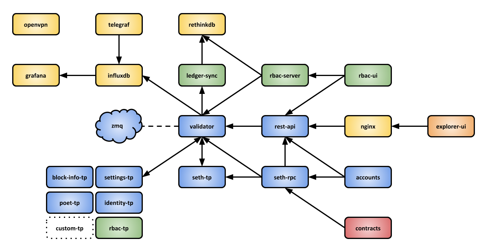
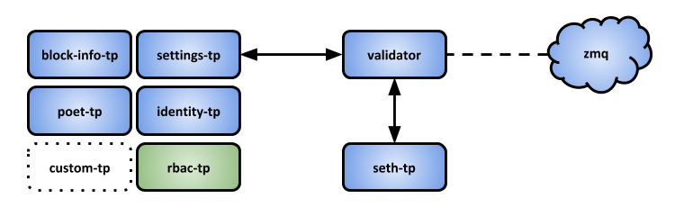

Sawtooth Platform
=================

The Hyperledger Sawtooth Platform that is deployed by Brooklyn creates two types of virtual machine. First, a *Server* node, which contains all the services that an end user will access, such as the Sawtooth Next Directory UI and the Sawtooth Explorer UI, as well as the API endpoints and the management services like Grafana.

Then, the platform includes a cluster of *Validator* nodes, which run the Sawtooth validator and all the required transaction processors.

---
Copyright 2018 Blockchain Technology Partners Limited; Licensed under the [Apache License, Version 2.0](./LICENSE)
